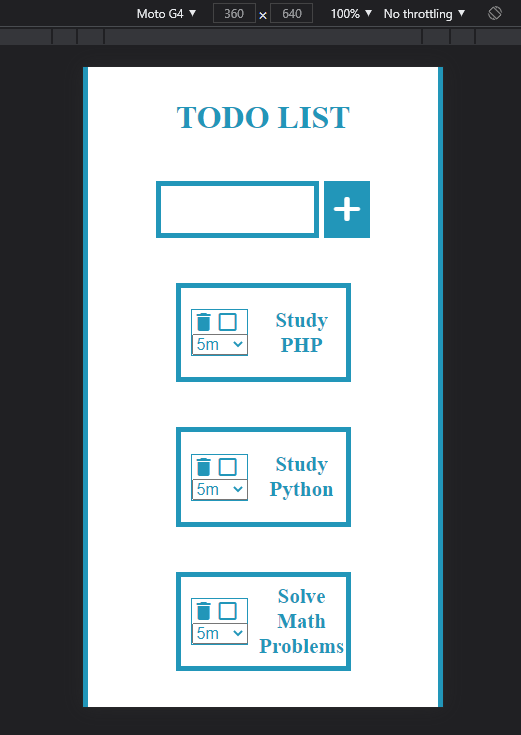
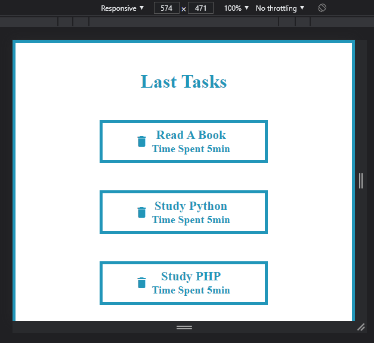
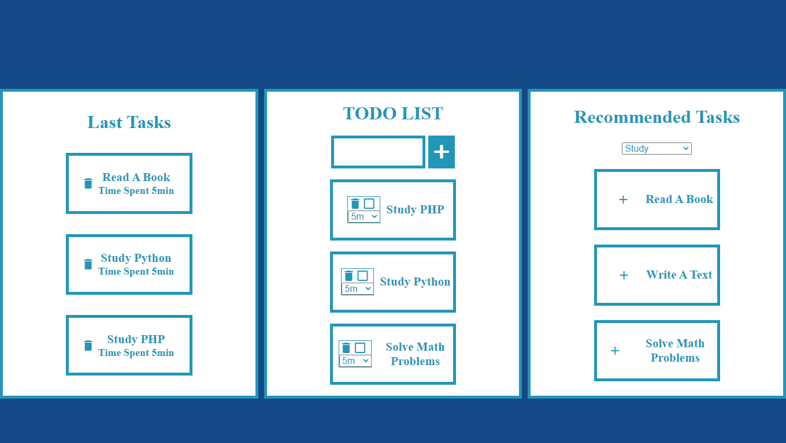

# TODO
### Resumo:
#### Um projeto para criar , salvar e deletar tarefas diarias.
## Layout responsivo

### Tecnologias utilizadas:
 - Express
 - React
 - Mysql
 - Jest
 - Chai
 - Yarn
 - Webpack

### Características:
 - [X] Apis
 - [X] Tests Apis
 - [X] Front
 - [ ] Tests Front
### Modo de uso:

<pre>
<code>
clone este repositorio
cd TODO
cd APP
yarn  start //para iniciar o servidor
yarn start:dev //para inicar o reactjs
yarn test //para testar as apis
</code>
</pre>
